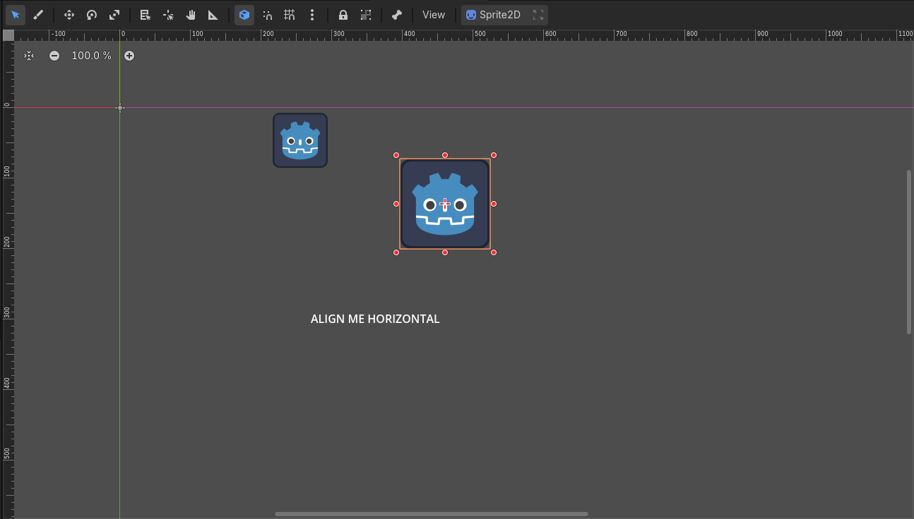
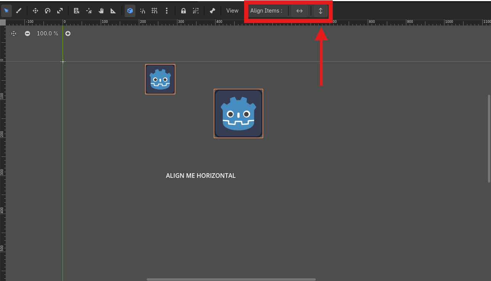

# tcfAlignTool - UI & 2D Alignment Plugin for Godot 4

A powerful, minimalist, and smart editor plugin designed for Godot 4.3+ and 4.7+ that allows you to horizontally or vertically align any selected canvas elements by their exact mathematical centers. 

Unlike Godot's built-in layout tools that align objects relative to their parent container, **tcfAlignTool** aligns objects **relative to each other (based on your selection order)**.

---

## ✨ Features

* **Universal 2D Support:** Cross-align any `CanvasItem` elements. You can align two UI nodes (`Control`), two game objects (`Node2D`/`Sprite2D`), or even hybrid selections like a **Sprite2D** and a **Label** together!
* **Smart Center Alignment:** Automatically calculates bounding boxes and centers. It won't just match top-left corners; it finds the absolute heart of different-sized nodes and aligns them perfectly.
* **Context-Aware UI:** The toolbar menu seamlessly hides when not needed and dynamically pops up only when you select 2 or more valid 2D nodes using `Shift`.
* **Full Undo/Redo Support:** Fully integrated with Godot's UndoRedo manager. Press `Ctrl + Z` to instantly revert any alignment action without breaking your scene tree.

---

## 📸 Screenshots & Usage

The tool dynamically registers an **"Align Items:"** toolbar right inside your 2D Workspace viewport menu when a multi-selection is active.

### 1. Vertical Alignment (Aligning Centers on X Axis)
Select multiple objects and click the vertical arrow button (**↕**) to snap their horizontal centers to the first selected target element.

### 2. Horizontal Alignment (Aligning Centers on Y Axis)
Select your misplaced elements and click the horizontal arrow button (**↔**) to perfectly line them up on the exact same horizontal center path.

### 3. Precision Node Calculations
No matter the texture size or bounding box offsets, the custom calculation algorithm tracks down the real center points under the hood.

### 4. Perfect Results Flawlessly Integrated
Keep your skill trees, HUD indicators, inventory grids, or level sprites flawlessly aligned in seconds!

---

## 🚀 How To Install

1. Download or clone this repository.
2. Copy the `addons/tcfAlignTool` folder into your own Godot project's `res://addons/` directory.
3. Open your Godot Project, navigate to **Project -> Project Settings -> Plugins**.
4. Find **Align Tool** in the list and check the **Enable** box.
5. Select any two 2D/UI elements with `Shift` and enjoy the frictionless workflow!

---

## 🧑‍💻 Author & Support

Created with ❤️ by **TheCodeFather**. 

If this addon saved your time and made your gamedev workflow smoother, consider supporting my journey! 

🚀 **Follow and Subscribe to my YouTube Channel for more Godot tutorials, devlogs, and advanced workflow tips:**  
[▶️ Click here to subscribe to my YouTube Channel!](https://youtube.com/thecodefather)

---

## 📄 License

This project is licensed under the **MIT License** - see the [LICENSE](LICENSE) file for details. 
You are free to use it in any commercial or personal game project.
